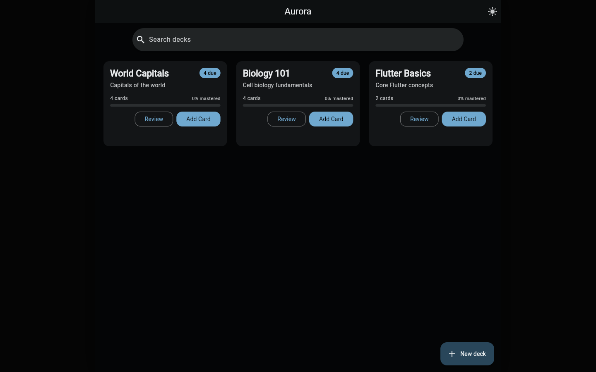
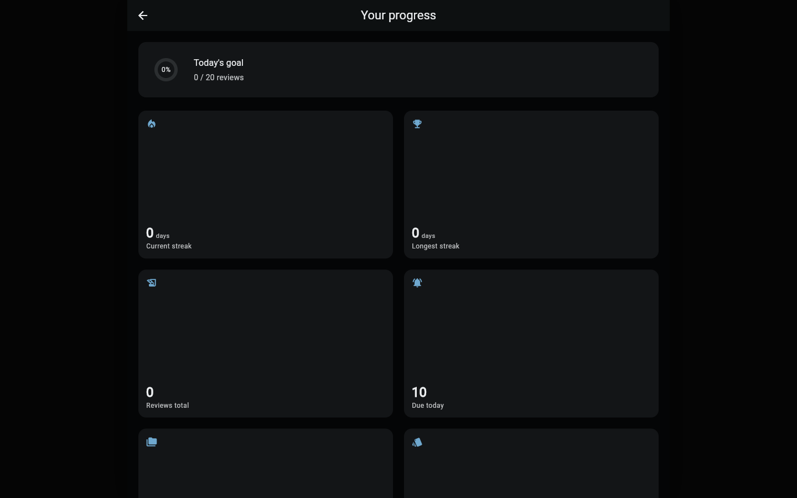
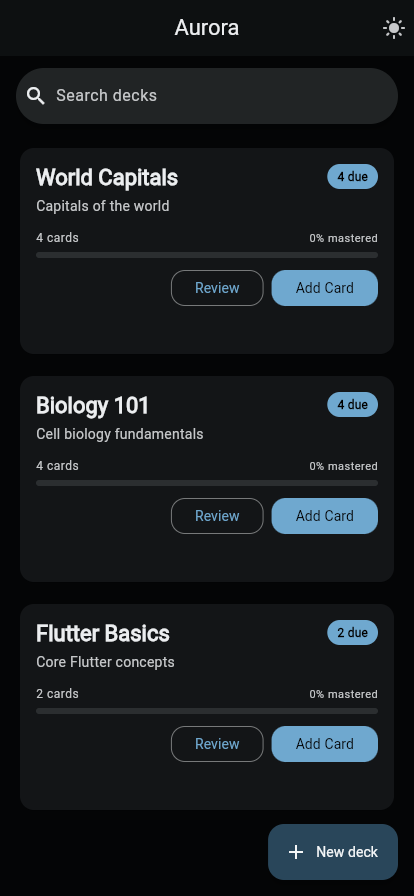
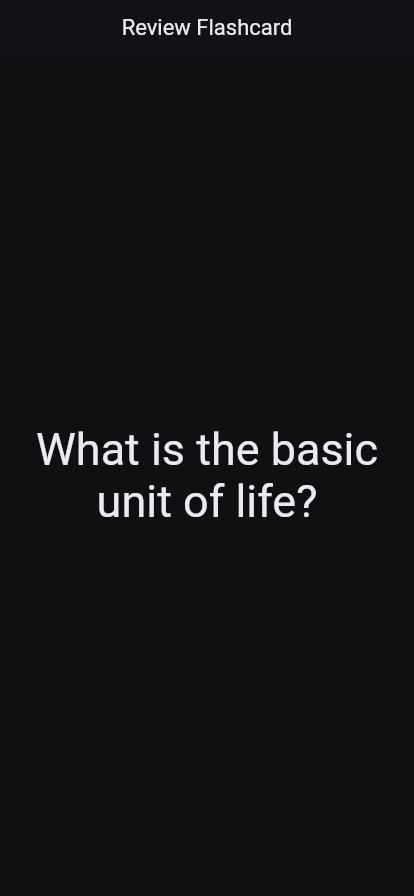
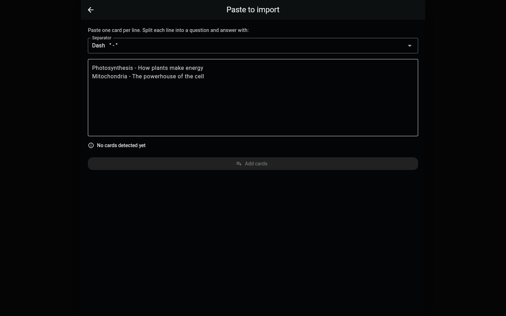

<p align="center">
  
</p>

<h1 align="center">Aurora</h1>

<p align="center">
  <b>A smart flashcard app that uses AI to generate flashcards from your documents —<br/>
  so you can spend less time making cards and more time learning.</b>
</p>

<p align="center">
  
  
  
</p>

<p align="center">
  <a href="https://aurora-flashcards.vercel.app"><b>🌐 Try the live web demo →</b></a>
</p>

---

**Aurora** turns your notes into a study deck you can review with spaced repetition — paste text (or import a PDF on mobile) and start learning. Built with Flutter and a clean, layered architecture (Bloc + repository), it runs natively on **iOS, Android, and the web**, adapting from a single phone column to a multi-column desktop layout.

## 📸 Screenshots

<p align="center">
  
</p>
<p align="center">
  
</p>

| Your decks | Study (SM-2) | Paste to import |
|:---:|:---:|:---:|
|  |  |  |

## ✨ Features

- **Spaced repetition** — study due cards with the proven **SM-2** algorithm; rate recall (Again / Hard / Good / Easy)
- **Streaks & daily goals** — a 🔥 streak and goal ring on the home bar keep the habit going
- **Progress dashboard** — totals, per-deck mastery, and a 14-day activity chart
- **Two quiz modes** — multiple-choice and written-answer practice
- **Bulk import** — paste text (one card per line) to build a deck in seconds; PDF → AI on mobile
- **Backup & restore** — export / import all your decks as JSON
- **Sample decks** — add ready-made starter decks with one tap
- **Deck insights & search** — per-deck due counts, mastery bars, and instant search
- **Settings** — system / light / dark theme, adjustable daily goal, reset progress
- **Responsive** — real multi-column layout on desktop/web, single-column on phones
- **Offline-first & private** — data stored locally (Hive on mobile, IndexedDB on web); no account required

## 🧱 Tech & architecture

| Concern | Choice |
|---|---|
| Architecture | Clean architecture (data / domain / presentation) |
| State management | `flutter_bloc` (Bloc pattern) |
| Dependency injection | `get_it` |
| Local database | `hive_ce` (mobile + web / IndexedDB) |
| Theming | `flex_color_scheme` |
| Networking | `dio` |
| Bulk import | paste-text (all platforms) · `read_pdf_text` (mobile PDF) |
| AI backend | [ChatPDF API](https://www.chatpdf.com/docs/api/backend) |

```
lib/src/
├── core/                  # shared building blocks
│   ├── errors/            # failures & exceptions
│   ├── router/            # route generation
│   ├── services/          # DI + connectivity
│   ├── theme/             # dynamic theming
│   ├── utils/             # constants, enums, strings
│   └── widgets/           # shared widgets
└── features/cards/
    ├── controller/        # Bloc (state management)
    ├── data/              # models, data sources, repositories
    └── presentation/      # screens & widgets
```

## 🚀 Getting started

**Prerequisites:** [Flutter](https://docs.flutter.dev/get-started/install) (Dart SDK ≥ 3.0.3).

```bash
# 1. Clone
git clone https://github.com/MohammedAl-Alimi/Aurora.git
cd Aurora

# 2. Install dependencies
flutter pub get
```

**3. (Optional) Add API keys.** Paste-import and everything else work without
any keys. The **mobile** PDF → flashcards feature uses the
[ChatPDF API](https://www.chatpdf.com/docs/api/backend); to enable it, copy the
example env file and fill in your keys:

```bash
cp .env.example .env
```

Then edit `.env`:

```
chatPdfApi=your_chatpdf_api_key
RAPID_API_KEY=your_rapidapi_key
```

> The `.env` file is gitignored and bundled as a Flutter asset at build time —
> never commit real keys.

**4. Run**

```bash
flutter run              # mobile (iOS / Android)
flutter run -d chrome    # in the browser
```

> The web build stores decks in the browser (IndexedDB via Hive) and seeds a
> few sample decks on first load, so you can try it instantly without a backend.

## 🗺️ Roadmap

- ✅ Spaced repetition (SM-2) + multiple-choice & written quizzes
- ✅ Runs on the web with a responsive desktop layout
- ✅ Paste-to-import, deck search, per-deck progress stats
- ⏳ AI generation on the web (via a serverless proxy so keys stay server-side)
- ⏳ Card-flip animations & keyboard shortcuts for web review

## 🤝 Contributing

Contributions are welcome — feel free to open an issue or a pull request for
features, fixes, or ideas.

## 📄 License

Released under the [MIT License](LICENSE) © 2025 Mohammed Al-Alimi.
